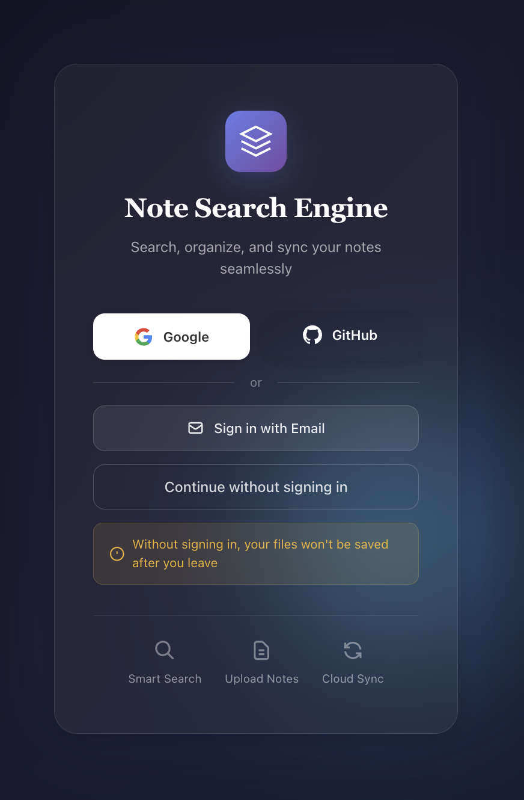
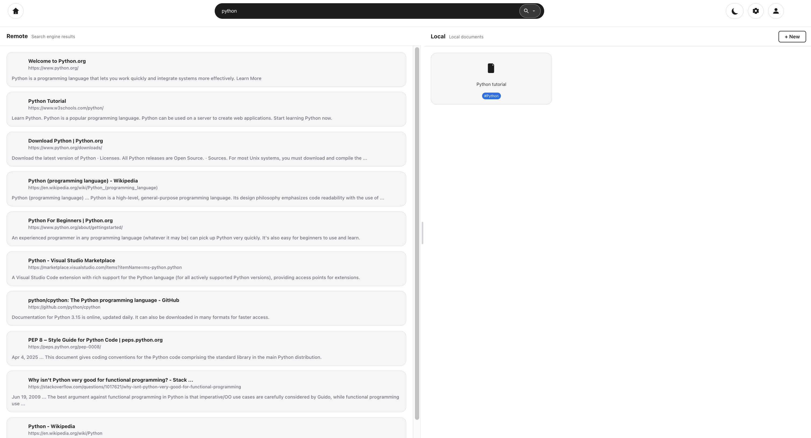
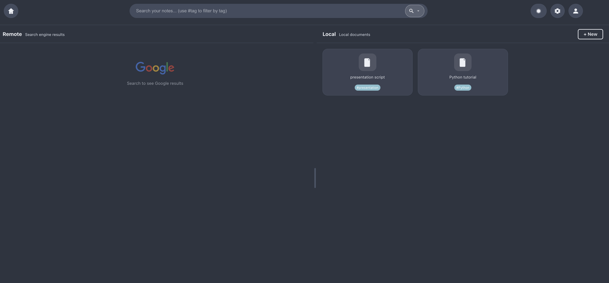
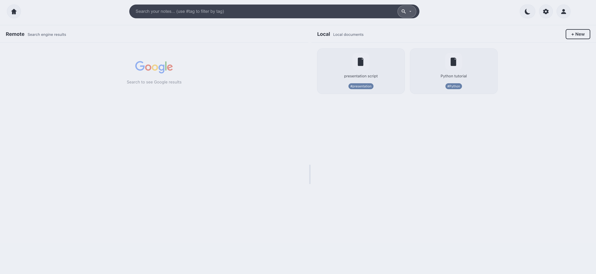
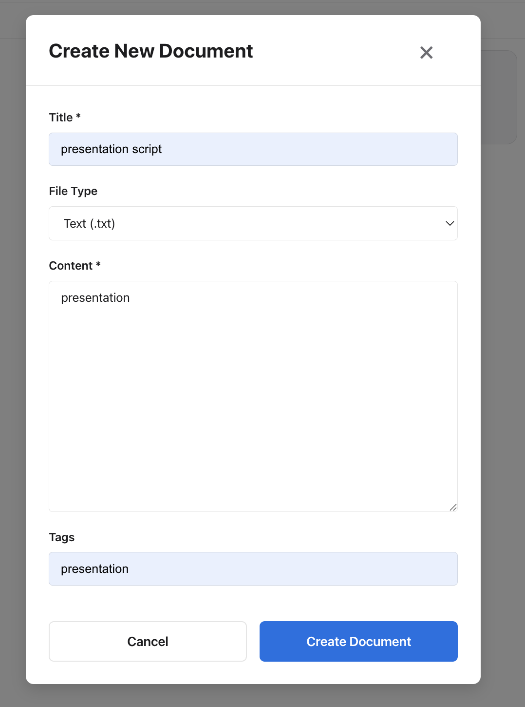
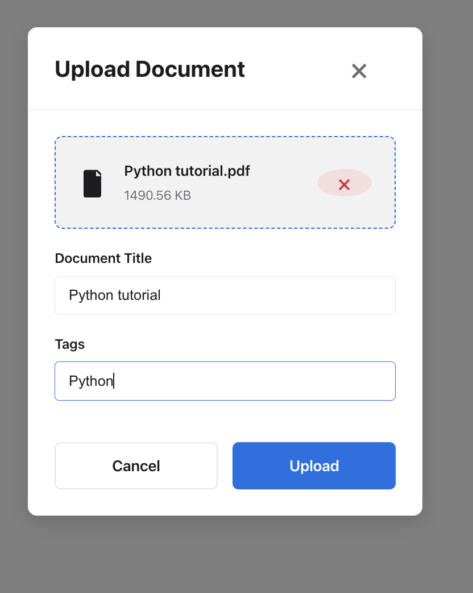
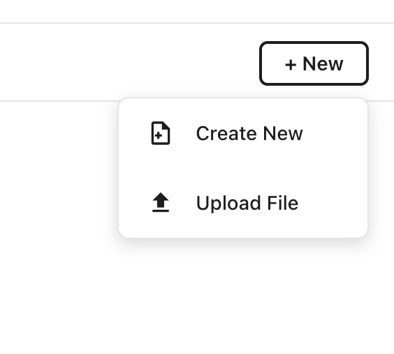
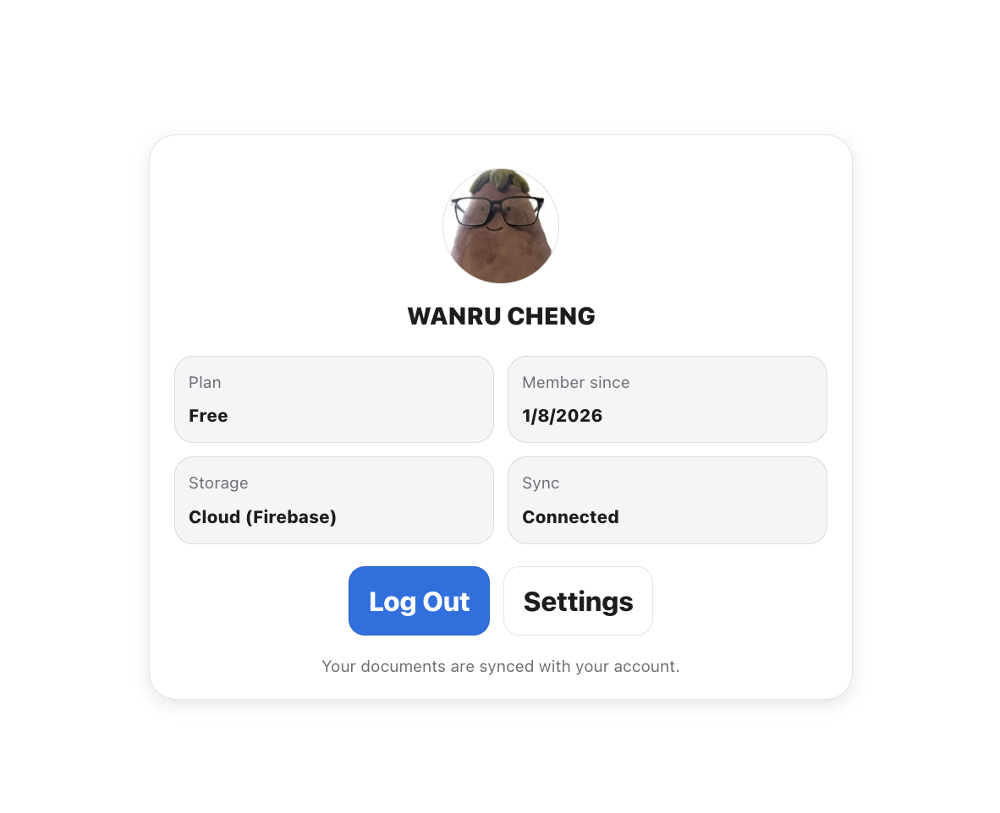
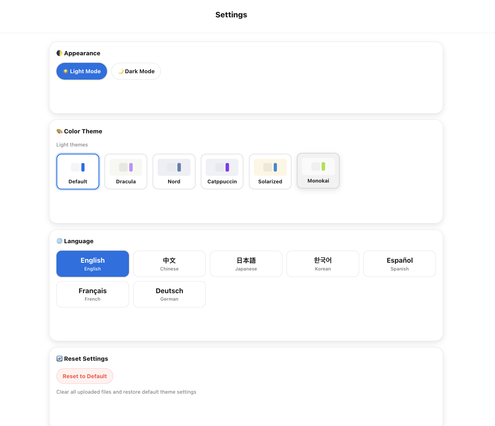

# Note Search Engine

A modern note search application with hybrid search capabilities, combining local document management with web search integration.

<p align="center">
  
</p>

## ✨ Features

- **Hybrid Search**: Combines BM25 and embedding-based search for accurate results
- **Multi-format Support**: Upload TXT, MD, PDF, and DOCX files
- **Google Search Integration**: Search the web alongside your local notes
- **Tag-based Organization**: Organize documents with tags and filter by tag
- **User Authentication**: Google, GitHub, Email/Password, and Guest mode via Firebase
- **Multi-language UI**: Supports English, Chinese, Japanese, Korean, Spanish, French, and German
- **Customizable Themes**: Multiple color themes with light/dark mode

---

## 🎬 Demo

### Authentication

Flexible sign-in options including Google, GitHub, Email/Password, or continue as a guest.

<p align="center">
  
</p>

---

### Hybrid Search

Split-view interface showing Google search results on the left and local documents on the right.

<p align="center">
  
</p>

---

### Home Page

Clean interface with Google search integration and local document library.

| Dark Mode | Light Mode |
|:---------:|:----------:|
|  |  |

---

### Document Management

Create new documents or upload existing files with custom tags.

| Create Document | Upload Document |
|:---------------:|:---------------:|
|  |  |

<p align="center">
  
</p>

---

### Account Management

Guest users can link their account later to save documents permanently.

| Guest User | Signed In |
|:----------:|:---------:|
|  |  |

---

### Settings

Customize appearance, color themes, and language preferences.

<p align="center">
  
</p>

---

## 🛠 Tech Stack

### Frontend
- React 18 + Vite
- React Router for navigation
- Firebase Authentication
- CSS Variables for theming

### Backend
- Node.js + Express
- MongoDB with Mongoose
- Custom tokenizer for mixed-language text
- BM25 search algorithm

---

## 🚀 Quick Start

### Prerequisites
- Node.js 18+
- MongoDB (local or Atlas)

### Installation

```bash
# Clone the repository
git clone https://github.com/Lou-Meixuan/Note_Search_Engine.git
cd Note_Search_Engine

# Install backend dependencies
cd backend
npm install

# Install frontend dependencies
cd ../frontend
npm install
```

### Configuration

1. **Backend**: Create `backend/.env`:
```env
MONGODB_URI=your_mongodb_connection_string
GOOGLE_API_KEY=your_google_api_key (optional)
GOOGLE_CX=your_google_search_cx (optional)
```

2. **Frontend**: Create `frontend/.env`:
```env
VITE_API_URL=http://localhost:3001
```

### Running Locally

```bash
# Terminal 1: Start backend
cd backend
npm start

# Terminal 2: Start frontend
cd frontend
npm run dev
```

Open http://localhost:5173 in your browser.

---

## 📁 Project Structure

```
Note_Search_Engine/
├── frontend/               # React frontend
│   ├── src/
│   │   ├── components/     # Reusable UI components
│   │   ├── context/        # React contexts (Auth, Theme, Language)
│   │   ├── pages/          # Page components
│   │   ├── i18n/           # Translations
│   │   └── config/         # API configuration
│   └── ...
├── backend/                # Node.js backend
│   ├── src/
│   │   ├── app/            # Express routes and server
│   │   ├── data_access/    # Database and external services
│   │   ├── entity/         # Domain entities
│   │   ├── interface_adapter/  # Controllers and repositories
│   │   └── use_case/       # Business logic
│   └── docs/               # Architecture documentation
└── README.md
```

---

## 🌐 Deployment

### Backend (Render)
1. Create a Web Service on [render.com](https://render.com)
2. Set root directory to `backend`
3. Add environment variables (MONGODB_URI, etc.)

### Frontend (Vercel)
1. Import project on [vercel.com](https://vercel.com)
2. Set root directory to `frontend`
3. Add `VITE_API_URL` pointing to your backend URL

---

## 📄 License

MIT License - see [LICENSE](LICENSE) for details.
